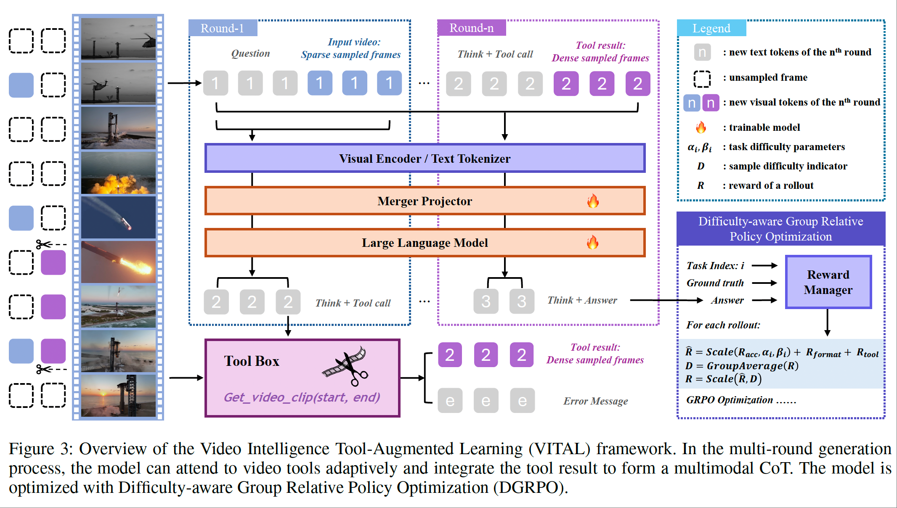

# Thinking With Videos: Multimodal Tool-Augmented Reinforcement Learning for Long Video Reasoning

<a href="https://zhang9302002.github.io/">Haoji Zhang</a><sup>\*</sup>,
<a href="https://gx77.github.io/GX/">Xin Gu</a><sup>\*</sup>,
Jiawen Li,
Chixiang Ma,
<a href="https://sulebai.github.io/">Sule Bai</a>,
<a href="https://lin-shan.com/">Chubin Zhang</a>,
Bowen Zhang,
Zhichao Zhou,
Dongliang He,
<a href="https://andytang15.github.io/">Yansong Tang</a><sup>&dagger;</sup>

<sup>\*</sup>Equal contributions, 
<sup>&dagger;</sup>Correspondence

<a href="https://zhang9302002.github.io/thinkingwithvideos-page/"></a>
<a href="https://arxiv.org/abs/2508.04416"></a>
<a href="https://huggingface.co/datasets/zhang9302002/MultiTaskVideoReasoning"></a>

We proposed **VITAL**, a tool-augmented framework that enables advanced long video reasoning and temporal grounding.

We also introduce **MTVR**, a high-quality multi-task video reasoning training dataset.




# MTVR Dataset
The dataset is available [here](https://huggingface.co/datasets/zhang9302002/MultiTaskVideoReasoning).

# Training and Evaluation
Code is coming soon.

# Citation
If you find this project useful in your research, please consider citing:

```
@article{zhang2025thinking,
  title={Thinking With Videos: Multimodal Tool-Augmented Reinforcement Learning for Long Video Reasoning},
  author={Zhang, Haoji and Gu, Xin and Li, Jiawen and Ma, Chixiang and Bai, Sule and Zhang, Chubin and Zhang, Bowen and Zhou, Zhichao and He, Dongliang and Tang, Yansong},
  journal={arXiv preprint arXiv:2508.04416},
  year={2025}
}
```